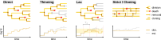

# Simulation Algorithms

Estimating the growth rate of a growing population of cells directly is difficult: since the number of cells will typically grow exponentially, obtaining reliable estimates has exponential complexity. Chemostats.jl bypasses this by using population control algorithms that only simulate a subset of the population, while still being able to extrapolate the expected number of cells with good accuracy.

All of these algorithms will terminate if the population dies out, as they cannot estimate growth rates in that case. In this case, simulations will have to be restarted. [`Chemostats.Thin`](@ref) and [`Chemostats.Lax`](@ref) both increase the probability of extinction, depending on parameter settings.

Chemostats.jl simulates cells independently of each other - direct cell-to-cell interactions are currently not supported. Except for [`Chemostats.Strict`](@ref), all algorithms below support parallelisation.



# Supported algorithms 
```@docs
Chemostats.Direct
Chemostats.Thin
Chemostats.Strict 
Chemostats.Lax
Chemostats.Forward
```