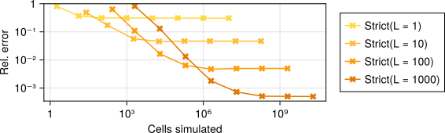
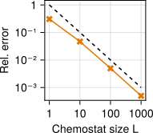
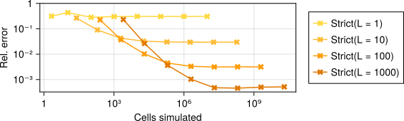
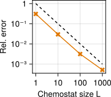

# Theory

The main goal of Chemostats.jl is to estimate growth rates of cell populations. Given sufficient resources, a population of cells will grow exponentially in number as

`` N(t) \sim e^{\Lambda t} ``

where ``N`` is the number of cells, ``t`` is time and ``\Lambda`` is the characteristic growth rate, which depends on the environment. For single-celled organisms such as bacteria, the growth rate is commonly used as a measure of evolutionary fitness: bacteria with a higher growth rate will outcompete others. Growth rates can also be used to estimate selection coefficients in population genetics. 

Estimating the growth rate of a simulated cell population is remarkably difficult. The na\"ive approach simulates a population for a time ``t``, counts the number of cells ``N(t)`` and estimates the growth rate as 

`` \hat \Lambda = \frac{\log N(t)}{t} ``

This does not scale well -- the number of cells we need to simulate grows _exponentially_ in ``t``, whereas the accuracy of the growth rate estimate only decreases as ``1/t``. This algorithm is implemented in Chemostats.jl via [`Chemostats.Direct()`](@ref).

A common alternative is to estimate the growth rate ``\Lambda`` by the mean generation time ``\overline{\tau}`` as

`` \hat \Lambda = (\log 2)/\overline \tau ``

We can do this by simulating a single lineage of cells, picking a random daughter cell at each division and estimating the long-term average of ``\tau``. This is implemented in Chemostats.jl via `Chemostats.Strict(1)`. Unfortunately, this is only accurate if generation times are very similar: in general, it systematically underestimates the true growth rate [1]. In other words: mean interdivision times are **not** mean doubling times. The reason is that population growth is exponential, not linear, and cells that divide faster than others disproportionately affect the growth rate. This approach also does not take into account cell death -- what happens when the tracked cell dies?

Simulating an entire cell population is too slow; simulating a single lineage is not accurate. Chemostats.jl gives the best of both worlds by simulating _some_, but not _all_ cells in a population, using the algorithms [`Chemostats.Lax`](@ref) and [`Chemostats.Strict`](@ref). The accuracy is controlled by the chemostat size ``L``, the number of lineages to be simulated at once. Increasing ``L`` yields more accurate results, at the expense of longer simulation times. As shown in [2], the typical error decreases as ``1 / \sqrt{L}``, whereas the runtime increases simply as ``L``. This means we can estimate growth rates accurately in (amortised) _quadratic_ time instead of exponential! In practice, setting ``L = 10`` or ``100`` should be sufficient to get good growth rate estimates.

## Example: Yule Process

Let us see this in action by considering a very simple model of cell division: every cell lives for an exponentially distributed amount of time ``\tau \sim \mathrm{Exp}(1)``. This is the Yule process, also known as the linear birth process. A simple calculation shows that this population grows with rate ``\Lambda = 1``. We can implement this in Julia as follows (see [here](@ref decell-page)):

```julia
using Chemostats
using Distributions
using OrdinaryDiffEq

# We represent each cell by a single variable `u`, the time to division.
# Then `u` follows a very simple ODE:
f(u, p, t) = -one(u)

# We divide when the time to division hits zero
div_cond(u, t, int) = u
cb_div = Chemostats.DivideCallback(div_cond)

# The time to division of every cell is exponentially distributed
u0 = randexp()

prob = ODEProblem(f, u0, (0, 1.); callback=cb_div)

function divide(int)
    # Return two cells with exponentially distributed times to division
    [ (u0 = randexp(), p = nothing), (u0 = randexp(), p = nothing) ]
end 

cells = [ DECell(prob, KenCarp4(), divide) ]
chem = Chemostat(cells)
```

Let us estimate the growth rate from a single lineage:
```julia
Chemostats.simulate!(chem, 1_000_000, Chemostats.Strict(1))

# The true growth rate is exactly 1
est_Λ(chem) # 0.692
```

Even though we simulate roughly a million generations, our estimate of the growth rate is off by 30%. 

We can investigate the estimation error depending on the Chemostat size ``L`` and the simulation time. The plot below shows the result for various choices of ``L`` and the [`Chemostats.Strict`](@ref) algorithm, described e.g. in [3,4]. The ``y``-axis shows the root mean square error (RMSE) over 10 runs, and the ``x``-axis measures computational effort by the number of cells simulated. For each value of ``L``, we simulate the system for times ``t = 1, 10, 100, \ldots``. Note that both axes are logarithmic.



We see that longer simulations times typically result in more accurate estimates, up to a point [1]. Beyond that, our estimates do not change, no matter how many cells we simulate. However, by increasing the chemostat size ``L``, we get increasingly more accurate estimates. This is verified in the plot below, which shows the long-term error as a function of ``L``:



Here the dashed line indicates `1 / L`. This log-log plot shows that the asymptotic error decreases in proportion to ``1 / L``, as predicted in [2].

## Example: Cell size control

Here we consider a simple model of cell size control [5] where each cell grows exponentially in size with rate ``1`` and divides once it hits a threshold size. The threshold size equals the birth size ``V_b`` plus a random amount ``\Delta \sim \Gamma(5, 0.2)``. When a cell divides, its daughters inherit a random fraction ``f`` of the parent's volume, where ``f \sim \Beta(1, 1)``.

```julia 
using Chemostats
using Distributions
using OrdinaryDiffEq

# We represent each cell by its size `u`, which grows exponentially in time:
f(u, p, t) = u

# We divide once a cell hits its division volume `V_d`, stored as a parameter
div_cond(u, t, int) = u - int.p.V_d
cb_div = Chemostats.DivideCallback(div_cond)

# The 
dist_Δ = Gamma(5, 0.2)
dist_div = Beta(1)

u0 = 1.
p = (V_d = 2.,)

prob = ODEProblem(f, u0, (0, 1.), p; callback=cb_div)

function divide(int)
    # Sample sizes of each daughter cell
    f = rand(dist_div)
    V1 = f * int.u
    V2 = (1 - f) * int.u

    # Return two cells with the given starting sizes and randomly sampled
    # division thresholds
    [ (u0 = V1, p = (V_d = V1 + rand(dist_Δ),)),
      (u0 = V2, p = (V_d = V2 + rand(dist_Δ),)) ]
end 

cells = [ DECell(prob, KenCarp4(), divide) ]
chem = Chemostat(cells)
```

Here again the true growth rate of the population is ``\Lambda = 1`` -- this agrees with the physical growth rate of each cell. Numerically estimating the growth rate yields the same picture as before:



Again our growth rate estimates are only good up to a point, unless we increase the chemostat size ``L``. The best possible error again decreases as ``1/L`` as shown in the plot below:



### References
[1] GrandPré, Levien, Amir. "Extremal events dictate population growth rate inference," arXiv:2501.08404, 2025

[2] Nemoto, Guevara Hidalgo, Lecomte. "Finite-time and finite-size scalings in the evaluation of large-deviation functions: Analytical study using a birth-death process," Phys. Rev. E 95(1), 2017

[3] Giardinà, Kurchan, Peliti. "Direct evaluation of large-deviation functions," Phys. Rev. Lett. 96(12), 2006

[4] Lecomte & Tailleur. "A numerical approach to large deviations in continuous time," J. Stat. Mech.: Theory Exp. 2007(3), 2007

[5] Amir. "Cell size regulation in bacteria," Phys. Rev. Lett. 112(20), 2014